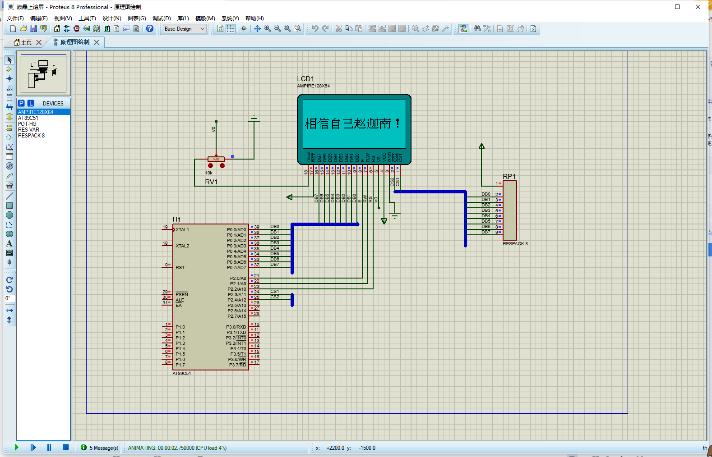
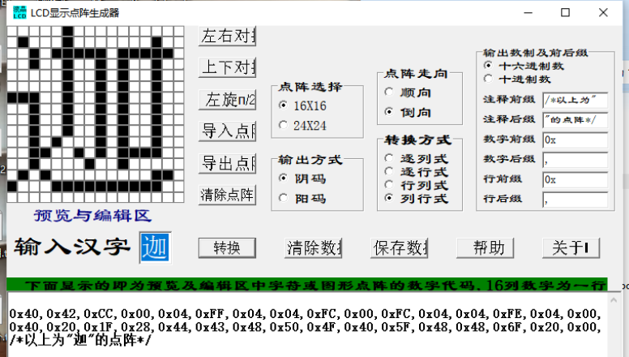

# 📺 LCD点阵式液晶上滚屏显示系统  

```markdown
> **项目名称**：点阵式液晶上滚屏显示系统  
> **开发平台**：Keil C51 + Proteus  
> **显示设备**：AMPIRE 128x64 LCD  
> **作者**：Jia'nan Zhao
> **时间**：2021年12月  
```

---

## 🎯 项目简介



```markdown
本项目实现了在 LCD 液晶显示屏上，从下往上**滚动显示“相信自己赵迦南！”**的功能。通过 51 单片机控制点阵式 LCD，在不高于 5 秒一个循环周期内完成汉字滚动显示效果。
```
---

## 🧱 系统构成

### 🔌 硬件组成

| 部件          | 描述                         |
|---------------|------------------------------|
| AT89C51       | MCS-51系列单片机              |
| LCD 128x64    | AMPIRE 128x64 点阵式液晶     |
| RESPACK-8     | 上拉电阻组件                  |
| POT-HG        | 滑动变阻器（调节亮度）       |

### 📊 电路设计环境

- 使用 **Proteus** 进行原理图绘制与仿真
- 仿真过程包括：LCD 控制、字符点阵显示、滚动刷新等功能

---

## 💡 显示效果说明


- 显示内容：`相信自己赵迦南！`
- 每个汉字使用 16x16 点阵，6 个汉字 + 1 个感叹号共 7 个字符
- 从底部逐渐滚动至顶部，形成循环滚动显示
- 单轮滚动周期小于 5 秒

---

## 🧩 程序设计逻辑

### 🚦 滚动流程图

```plaintext
初始化LCD
↓
清屏
↓
i = 0
↓
循环：i 从 0 滚动到 128
  └─ SetStartLine(i)
      └─ Display(...汉字点阵...)
↓
延时 → i++
↓
循环往复
````

### 📦 汉字点阵数据示例（以“迦”为例）



```c
0x04,0xE4,0x24,0x24,0x64,0xA4,0x24,0x3F,0x24,0xA4,0x64,0x24,0x24,0xF6,0x24,0x00,
0x00,0xFF,0x00,0x09,0x09,0x09,0x09,0x7F,0x09,0x09,0x09,0x49,0x80,0x7F,0x00,0x00,
/*以上为"南"的点阵*/
```

### 🧠 主程序核心片段

```c
for(i = 0; i < 128; i++) {
    SetStartLine(i);  // 设置滚动行起点
    Display(...);     // 依次显示7个字符的点阵数据
    delay(50);        // 控制滚动速度
}
```

---

## 🛠 开发环境配置

### 🔧 Keil C51 配置

* 新建 `main.c`
* 在 **Output** 设置中勾选 `Create HEX File`
* 编译生成 `.hex` 文件供 Proteus 导入

### 📦 点阵编码生成工具建议

> 使用【LCD中文点阵生成器】

* 字模格式：16x16、阴码、倒向、列行式
* 输入：相信自己赵迦南！
* 输出：每个字对应 32 字节点阵码

---

## 🧪 Proteus 仿真设置

1. 在 Proteus 中导入电路图（AT89C51 + LCD + 阻容元件）
2. 双击单片机加载 `.hex` 文件
3. 点击“运行”后，屏幕会看到循环滚动显示效果
4. 如下图所示：

```plaintext
┌────────────────────┐
│                    │
│   相信自己赵迦南！   ↑
│                    │
└────────────────────┘
```

---

## 🎓 项目总结与收获

* 加深对 LCD 液晶控制流程的理解
* 熟悉 Proteus 联合 Keil C51 的软硬件仿真流程
* 提高对中断、延时、I/O 接口的综合编程能力
* 锻炼独立查错调试与汉字点阵设计的动手能力

---

## 📚 参考资料

1. 《单片机原理与应用系统设计（第二版）》马秀丽 等，清华大学出版社
2. 《51系列单片机设计实例》楼然苗 等，北京航空航天出版社
3. 《单片机原理与应用》唐俊翟，冶金工业出版社
4. 《单片机原理及应用教程》刘瑞新，机械工业出版社

---

